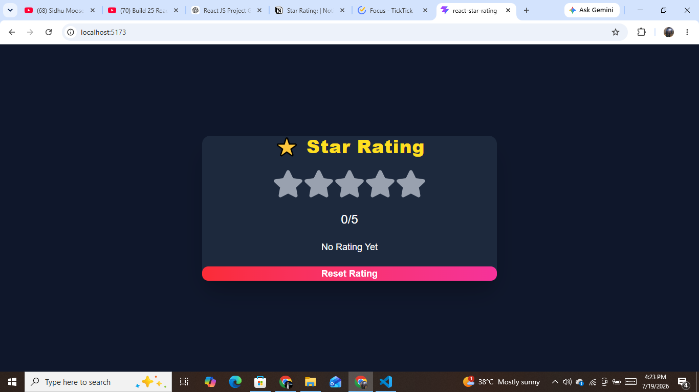

# ⭐ React Star Rating

An interactive **Star Rating** application built with **React**, **Vite**, **Tailwind CSS**, and **React Icons**. Users can hover over stars, select a rating, view dynamic feedback, and reset their rating with a single click.

## 🚀 Live Demo

🔗 https://your-vercel-link.vercel.app

## 📸 Preview



## ✨ Features

- ⭐ Interactive 5-star rating system
- 🖱️ Hover preview before selection
- 🎯 Click to select a rating
- 💬 Dynamic rating feedback messages
- 🔄 Reset rating functionality
- 🎨 Modern responsive UI with Tailwind CSS
- ⚡ Smooth hover and click animations

---

## 🛠️ Built With

- React
- Vite
- Tailwind CSS
- React Icons
- JavaScript (ES6+)

---

## 📂 Project Structure

```text
src/
│── assets/
│── components/
│   └── StarRating.jsx
│── App.jsx
│── main.jsx
│── index.css
```

---

## 📦 Installation

Clone the repository:

```bash
git clone https://github.com/shahzadgull46/react-star-rating.git
```

Navigate to the project folder:

```bash
cd react-star-rating
```

Install dependencies:

```bash
npm install
```

Start the development server:

```bash
npm run dev
```

---

## 🎯 Learning Outcomes

This project helped reinforce:

- React Functional Components
- React Hooks (`useState`)
- Conditional Rendering
- Event Handling
- Dynamic UI Updates
- Array Mapping
- Tailwind CSS Styling
- Component-Based Development

---

## 📈 Future Improvements

- Half-star rating support
- Save rating using Local Storage
- Keyboard accessibility
- Dark / Light mode toggle
- Customizable number of stars

---

## 👨‍💻 Author

**Shahzad Gull**

- GitHub: https://github.com/shahzadgull46

---

## 📄 License

This project is open source and available under the MIT License.